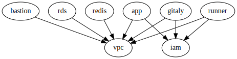

# "Live" репозиторий для инсталляции GitLab CI в AWS

Инфраструктура инсталляции GitLab в AWS разделена на два окружения - dev и prod.
Окружение dev используется для отладки и тестирования инфраструктурного кода (Terraform и Ansible),
prod-окружение предоставляет сервис непрерывной интеграции командам разработки.

Запуск инфраструктуры выполняется в два этапа - развертывание инфраструктуры в AWS
с помощью Terraform и развертывание приложения GitLab с помощью Ansible.

## Terraform Modules

Код используемых модулей можно найти в вышележащих репозиториях. Первой развертывается сетевая инфраструктура VPC,
затем сервисы хранения данных приложения GitLab (PostgreSQL и Redis), затем серверы (EC2 инстансы) приложения GitLab.

## Terragrunt

Для обеспечения разделения окружений и исключения повторения кода используется [terragrunt](https://terragrunt.gruntwork.io/)
