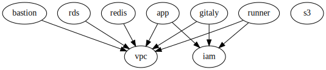

# "Live" репозиторий для инсталляции GitLab CI в AWS

Инфраструктура инсталляции GitLab в AWS разделена на два окружения - dev и prod.
Окружение dev используется для отладки и тестирования инфраструктурного кода (Terraform и Ansible),
prod-окружение предоставляет сервис непрерывной интеграции командам разработки.

Запуск инфраструктуры выполняется в два этапа - развертывание инфраструктуры в AWS
с помощью Terraform и развертывание приложения GitLab с помощью Ansible.

## Terraform Modules

Код используемых модулей можно найти в вышележащих репозиториях. Первой развертывается сетевая инфраструктура VPC,
затем сервисы хранения данных приложения GitLab (PostgreSQL и Redis) и серверы (EC2 инстансы) приложения GitLab.



## Terragrunt

Для обеспечения разделения окружений и исключения повторения кода используется [terragrunt](https://terragrunt.gruntwork.io/)

## Процесс разработки

### Структура директорий
Разработка модулей ведется в dev-окружении и для снижения задержки обновления кода, в terragrunt.hcl
конфигурационных файлах указаны локальные пути расположения модулей. Пути соответствуют следующему дереву директорий:

```
itd27m01-automation-solutions
└── gitlab-ci-aws
    ├── README.md
    ├── envs
    │   ├── dev
    │   │   ├── Makefile
    │   │   ├── app
    │   │   ├── bastion
    │   │   ├── gitaly
    │   │   ├── iam
    │   │   ├── rds
    │   │   ├── redis
    │   │   ├── runner
    │   │   ├── terragrunt.hcl
    │   │   └── vpc
    │   └── prod
    │       ├── app
    │       ├── bastion
    │       ├── gitaly
    │       ├── iam
    │       ├── rds
    │       ├── redis
    │       ├── runner
    │       ├── terragrunt.hcl
    │       └── vpc
modules
├── gitlab-ci-aws-app
├── gitlab-ci-aws-bastion
├── gitlab-ci-aws-gitaly
├── gitlab-ci-aws-iam
├── gitlab-ci-aws-rds
├── gitlab-ci-aws-redis
├── gitlab-ci-aws-runner
└── gitlab-ci-aws-vpc
```

Для запуска окружения выполнить:

```
cd envs/dev
make plan
make apply
```

